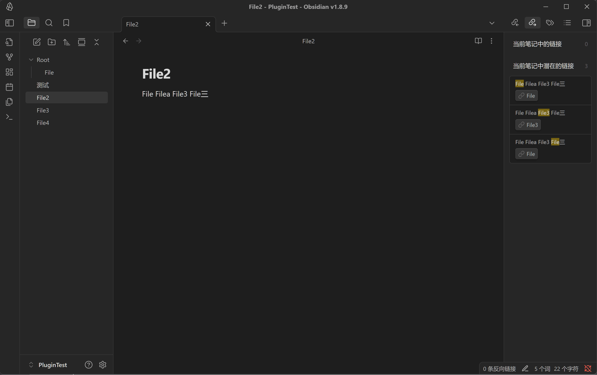
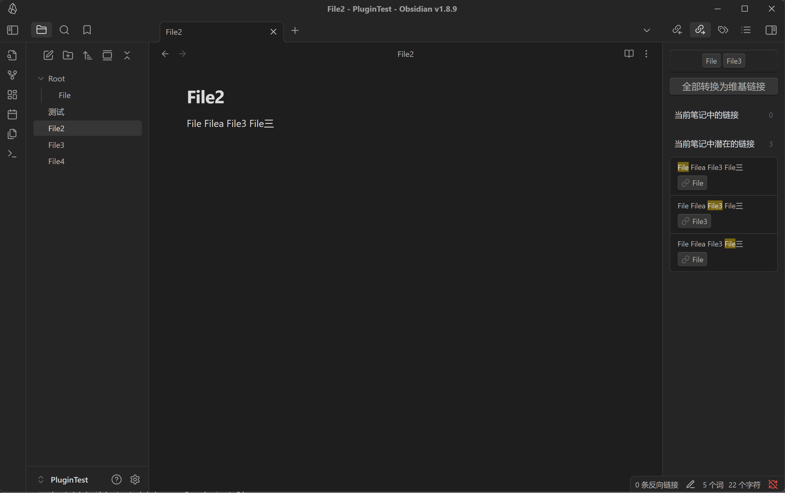
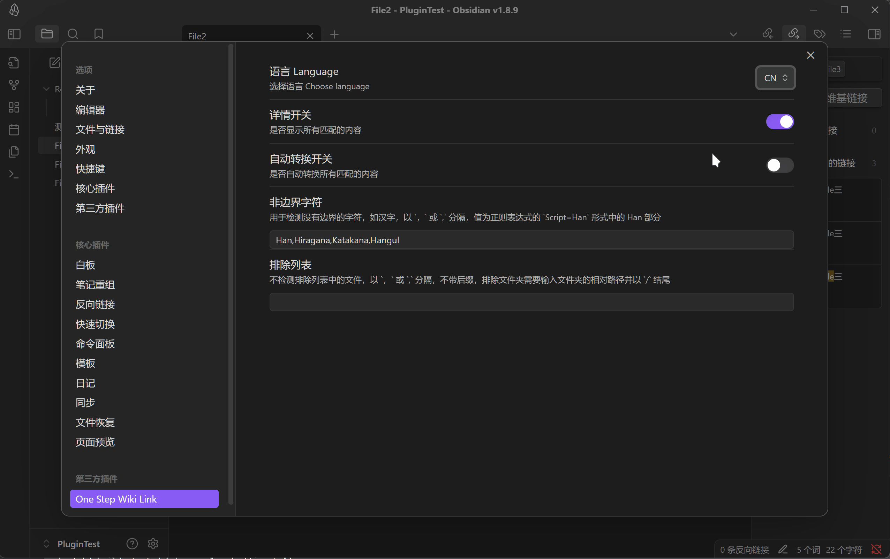
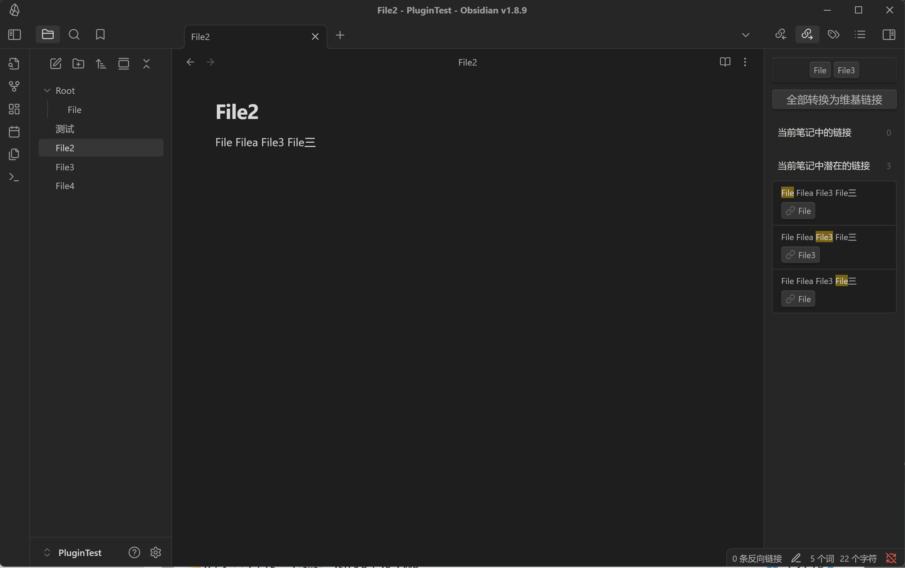
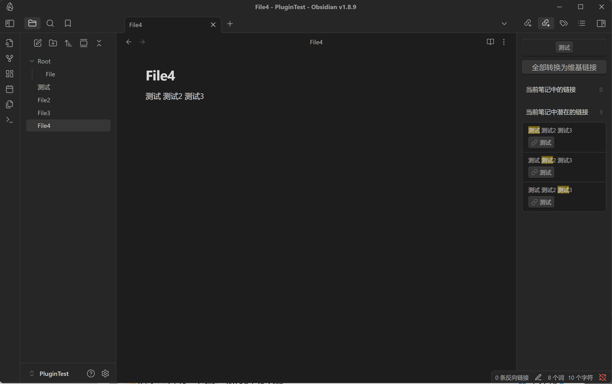

# 一步维基链接

## 介绍

> 本插件支持中文和英文界面

一步维基链接是一个 Obisidian 插件，它可以让你在编辑器中一步转换当前打开的文档中匹配的维基链接（出链链接）。

该插件支持手动转换和自动转换维基链接，并且可以选择排除部分文件或目录，从而避免转换不必要的链接。

启用本插件后，出链界面会多出两个新元素：

* 当前界面所有潜在的匹配文本（基于插件的匹配规则）
* 转换按钮，点击该按钮可以将当前界面所有匹配的文本转换为维基链接。

或者你可以选择使用命令 `Convert All Matching Words to Wiki Links` 来执行转换。

## 自定义设置

> 设置面板有具体的使用方式描述

* 详情开关：打开或关闭插件的详细信息。
* 自动转换开关：打开或关闭自动转换维基链接。
* 非边界字符：用于检测没有边界的字符，如果部分语言匹配出现问题，可以添加该字符以使用非边界正则匹配。
* 排除文件或目录：输入文件或目录的名称，以逗号分隔，插件将不会转换这些文件或目录中的维基链接。
* 快捷键：设置快捷键以触发转换命令。

## 演示

### 详情和转换

### 详情开关

### 自动转换

### 排除文件或目录

### 非边界字符

# OneStepWikiLink

## Introduction

> This plugin supports both Chinese and English interfaces

OneStepWikiLink is an Obisidian plugin that allows you to convert matched Wiki links(outlinks) in the current opened document in one step.

The plugin supports manual conversion and automatic conversion of Wiki links, and you can choose to exclude certain files or directories to avoid unnecessary conversions.

After enabling this plugin, there will be two new elements on the outlink interface:

* All potential matches in the current document (based on the plugin's matching rules)
* The Convert button, which will convert all matched text in the current document to Wiki links.

Or you can use the command `Convert All Matching Words to Wiki Links` to perform the conversion. 

## Customization

> The settings panel has specific usage instructions

* Detail switch: Turn on or off the plugin's detailed information.
* Auto-conversion switch: Turn on or off automatic conversion of Wiki links.
* Non-boundary characters: Used to detect characters without boundaries, if some languages have problems with matching, you can add this character to use non-boundary regular expressions.
* Exclude files or directories: Enter the name of the file or directory separated by commas, and the plugin will not convert Wiki links in these files or directories.
* Shortcut: Set the shortcut to trigger the conversion command.

## Demo

### Details and Conversion

### Detail Switch

### Auto-Conversion

### Exclude Files or Directories

### Non-Boundary Characters

